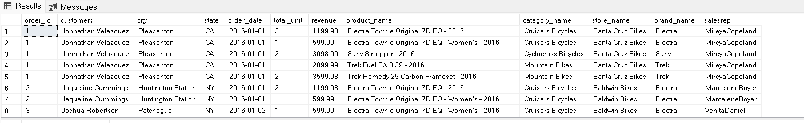
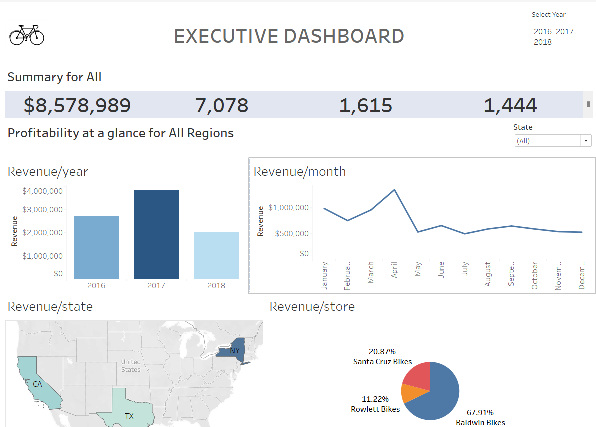

# Bike Store Sales Analysis

This project focuses on analyzing the sales data of a bike store to gain insights into revenue trends, customer behavior, and sales performance. The analysis includes revenue per year, revenue per state, revenue per store brand, top 10 customers, and revenue per sales representative.

## Table of Contents

- [Introduction](#introduction)
- [Technologies Used](#technologies-used)
- [Data Source](#data-source)
- [Setup](#setup)
- [Analysis](#analysis)
- [Tableau Dashboard](#tableau-dashboard)
- [Conclusion](#conclusion)
- [Contact](#contact)

## Introduction

The Bike Store Sales Analysis project aims to provide a comprehensive understanding of the sales data of a bike store. By analyzing various aspects such as revenue per year, revenue per state, revenue per store brand, top 10 customers, and revenue per sales representative, we can gain insights into customer behavior, identify top-performing regions and brands, and evaluate the performance of sales representatives.

## Technologies Used

- SQL (microsoft sql server management studio) : Used to retrieve and manipulate the necessary data from the database.
- Tableau: Used to create interactive visualizations and dashboards based on the analyzed data.

## Data Source

The analysis is based on a dataset that includes information about bike store sales, customer details, product information, and staff data. The dataset provides the foundation for the analysis and visualization of the sales data.

## Setup

To replicate this project locally, follow these steps:

1. Clone the repository:

```shell
git clone https://github.com/tymnastic/bike-store-sales-analysis.git
```

2. Set up the database: Ensure that you have a compatible database management system installed (e.g. MSSMS,, MySQL, PostgreSQL). Create the necessary tables and import the provided dataset.

3. Configure the connection: Update the database connection details in the SQL query file or scripts used for data retrieval.

4. Install Tableau: Download and install Tableau Desktop or use Tableau Public for visualization and dashboard creation.

## Analysis

The analysis was performed by running SQL queries on the sales data to retrieve the required information. The SQL queries utilized joins to combine data from multiple tables. The following joins were used:

- `JOIN sales.customers cus ON ord.customer_id = cus.customer_id`: Joins the `sales.orders` and `sales.customers` tables based on the customer ID to retrieve customer details.
- `JOIN sales.order_items ite ON ord.order_id = ite.order_id`: Joins the `sales.orders` and `sales.order_items` tables based on the order ID to retrieve order item details.
- `JOIN sales.stores sto ON sto.store_id = ord.store_id`: Joins the `sales.orders` and `sales.stores` tables based on the store ID to retrieve store details.
- `JOIN sales.staffs sta ON sta.staff_id = ord.staff_id`: Joins the `sales.orders` and `sales.staffs` tables based on the staff ID to retrieve staff details.

The results of the SQL queries were then imported into Tableau for visualization and creating the interactive dashboard.



## Tableau Dashboard

The Tableau dashboard provides a visual representation of the analyzed data, allowing for exploration and in-depth analysis of the bike store sales. The dashboard includes the following visualizations:

1. Revenue per Year
2. Revenue per State
3. Revenue per Store Brand
4. Top 10 Customers
5. Revenue per Sales Representative



Access the Tableau dashboard and interact with it by clicking on the following link: [Tableau Dashboard](https://public.tableau.com/app/profile/timilehin.onileimo/viz/bIKESTORE/Dashboard1)
